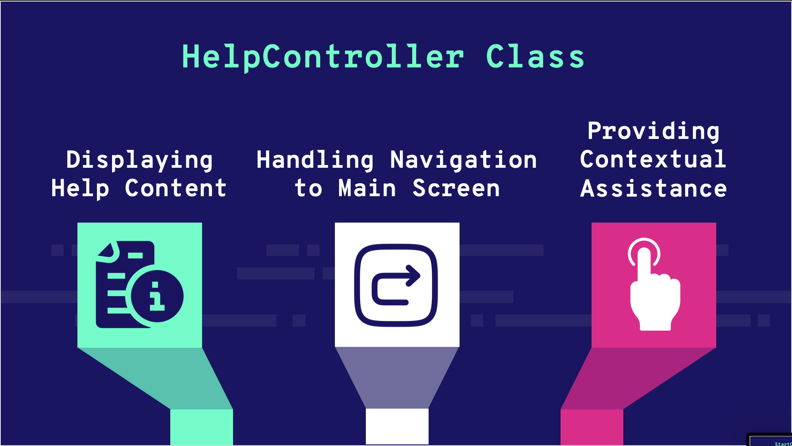

## Memory Cards Game - Flipping Tiles





### In order to play the game, follow these steps:
1. Open your terminal and change the Directory to Desktop
```
cd Desktop
```
2. Clone the repository on your Desktop
```
git clone https://github.com/azimifardous/MemoryCard-Project.git
```
3. Change the path of directory to the project folder
```
cd MemoryCard-Project/MemoryCards
```
3. Finally Open the Folder with your IDE
4. Run the Main.java Class


